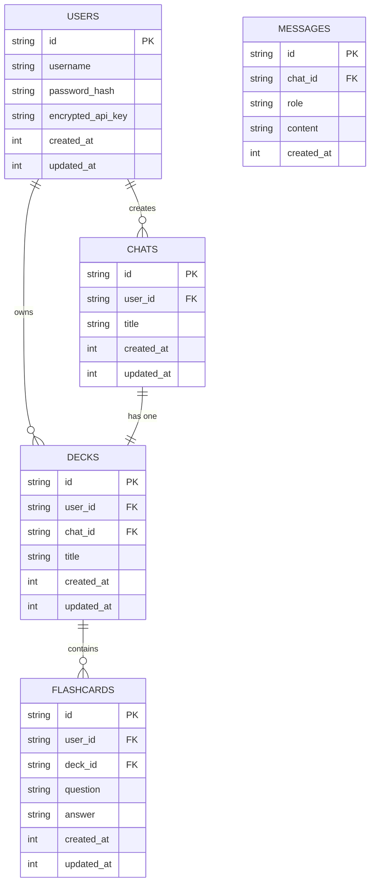

# LLM Flashcard Chat Application

A web application that allows users to chat with Claude 3.7 and automatically generate flashcards from their conversations.

## Project Structure

This project consists of two main parts:

1. **Frontend**: A Next.js application with React components for the user interface
2. **Backend**: A Cloudflare Workers API with D1 database for data storage

```
/
├── app/                  # Next.js frontend application
│   ├── chat/             # Chat page
│   ├── flashcards/       # Flashcards page
│   └── login/            # Login page
├── components/           # React components
├── contexts/             # React context providers
├── hooks/                # Custom React hooks
├── lib/                  # Utility functions
├── public/               # Static assets
├── services/             # API service functions
├── types/                # TypeScript type definitions
└── backend/              # Cloudflare Workers backend
    ├── src/              # Backend source code
    │   ├── middleware/   # Middleware functions
    │   ├── routes/       # API routes
    │   ├── services/     # Business logic
    │   ├── utils/        # Utility functions
    │   └── types/        # Type definitions
    └── wrangler.toml     # Cloudflare Workers configuration
```

## Features

- **User Authentication**: Register, login, and secure API access
- **Chat Interface**: Conversational interface with Claude 3.7
- **Flashcard Generation**: Automatically generate flashcards from chat conversations
- **Flashcard Management**: Create, edit, and delete flashcards

## Technologies Used

### Frontend
- Next.js
- React
- TypeScript
- Tailwind CSS
- shadcn/ui components

### Backend
- Cloudflare Workers
- Cloudflare D1 (SQLite database)
- Hono (web framework)
- Anthropic Claude 3.7 API

## Setup and Development

### Prerequisites
- Node.js (v18 or later)
- npm or pnpm
- Cloudflare account
- Anthropic API key

### Frontend Setup

1. Install dependencies:
   ```
   npm install
   # or
   pnpm install
   ```

2. Run the development server:
   ```
   npm run dev
   # or
   pnpm dev
   ```

3. Open [http://localhost:3000](http://localhost:3000) in your browser.

### Backend Setup

1. Navigate to the backend directory:
   ```
   cd backend
   ```

2. Install dependencies:
   ```
   npm install
   # or
   pnpm install
   ```

3. Login to Cloudflare:
   ```
   npx wrangler login
   ```

4. Create a D1 database:
   ```
   npx wrangler d1 create llm_flashcard_db
   ```

5. Update the `wrangler.toml` file with your database ID.

6. Initialize the database schema:
   ```
   npm run setup-db:local
   ```

7. Start the development server:
   ```
   npm run dev
   ```

### Running Both Servers

For convenience, you can use the provided script to start both the frontend and backend servers:

```
./start-dev-servers.sh
```

This will start the backend server on port 8787 and the frontend server on port 3000 (or 3001 if 3000 is already in use).

## Debugging

The application includes several diagnostic tools to help debug authentication and API key issues:

1. **Authentication Flow Test**: A comprehensive test of the complete authentication flow.
   - Access: http://localhost:3000/test-auth-flow.html

2. **Test Login Page**: A simple interface to test login, registration, and API key storage.
   - Access: http://localhost:3000/test-login.html

3. **Claude API Key Test**: Tests the Claude API key verification functionality.
   - Access: http://localhost:3000/test-claude-api-key.html

For detailed information about debugging authentication and API key issues, see [DEBUGGING.md](DEBUGGING.md).

### Development Mode API Keys

In development mode, you can use test API keys that start with `sk-ant-test` (e.g., `sk-ant-test123456789`). These keys will be accepted without making an API call to Anthropic, allowing you to test the authentication flow without needing a real API key.

## Deployment

### Frontend Deployment

The frontend can be deployed to Vercel or any other Next.js-compatible hosting service:

```
npm run build
npm run start
```

### Backend Deployment

The backend can be deployed to Cloudflare Workers:

1. Deploy to Cloudflare Workers:
   ```
   cd backend
   npm run deploy
   ```

2. Initialize the production database schema:
   ```
   npm run setup-db
   ```

## Environment Variables

### Frontend
- `NEXT_PUBLIC_API_URL`: URL of the backend API

### Backend
- `JWT_SECRET`: Secret key for JWT token generation and verification
- `ENCRYPTION_KEY`: Key for encrypting and decrypting API keys

## Database Schema

The LLM Flashcard application uses the following database schema:



## License

MIT
