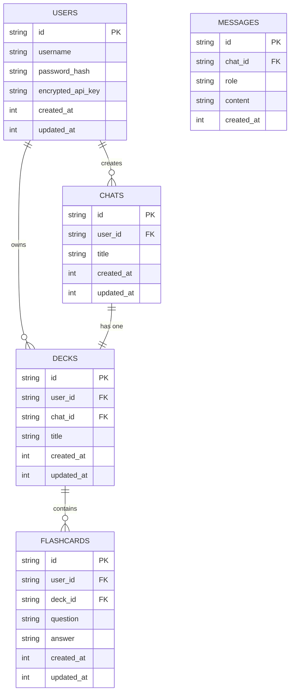

# LLM Flashcard

A web application for creating and studying flashcards generated from conversations with Claude AI.

## Features

- Chat with Claude AI to learn about any topic
- Automatically generate flashcards from your conversations
- Study flashcards with spaced repetition
- Side-by-side view for chatting and studying simultaneously
- Markdown support for rich text formatting

## Tech Stack

- **Frontend**: Next.js, React, TypeScript, Tailwind CSS
- **Backend**: Cloudflare Workers, Hono, D1 Database
- **Authentication**: JWT-based authentication
- **AI**: Claude API for conversation and flashcard generation

## Development

### Prerequisites

- Node.js 18+
- npm or pnpm
- Cloudflare account (for backend deployment)
- Anthropic API key (for Claude AI)

### Setup

1. Clone the repository
2. Install dependencies:
   ```bash
   npm install
   ```
3. Set up environment variables:
   - Create a `.env.local` file in the root directory
   - Add the following variables:
     ```
     NEXT_PUBLIC_API_URL=http://localhost:8787
     ```

4. Start the development server:
   ```bash
   npm run dev
   ```
5. Open [http://localhost:3000](http://localhost:3000) in your browser.

### Backend Setup

1. Navigate to the backend directory:
   ```
   cd backend
   ```

2. Install dependencies:
   ```
   npm install
   # or
   pnpm install
   ```

3. Login to Cloudflare:
   ```
   npx wrangler login
   ```

4. Create a D1 database:
   ```
   npx wrangler d1 create llm_flashcard_db
   ```

5. Update the `wrangler.toml` file with your database ID.

6. Initialize the database schema:
   ```
   npm run setup-db:local
   ```

7. Start the development server:
   ```
   npm run dev
   ```

### Running Both Servers

For convenience, you can use the provided script to start both the frontend and backend servers:

```
./scripts/start-dev-servers.sh
```

This will start the backend server on port 8787 and the frontend server on port 3000 (or 3001 if 3000 is already in use).

## Testing

Run tests with:

```bash
npm test
```

## Debugging

For detailed information about debugging authentication and API key issues, see [DEBUGGING.md](DEBUGGING.md).

### Development Mode API Keys

In development mode, you can use test API keys that start with `sk-ant-test` (e.g., `sk-ant-test123456789`). These keys will be accepted without making an API call to Anthropic, allowing you to test the authentication flow without needing a real API key.

## Deployment

### Frontend Deployment

The frontend can be deployed to Vercel or any other Next.js-compatible hosting service:

```
npm run build
npm run start
```

### Backend Deployment

The backend can be deployed to Cloudflare Workers:

1. Deploy to Cloudflare Workers:
   ```
   cd backend
   npm run deploy
   ```

2. Initialize the production database schema:
   ```
   npm run setup-db
   ```

## Environment Variables

### Frontend
- `NEXT_PUBLIC_API_URL`: URL of the backend API

### Backend
- `JWT_SECRET`: Secret key for JWT token generation and verification
- `ENCRYPTION_KEY`: Key for encrypting and decrypting API keys

## Database Schema

The LLM Flashcard application uses the following database schema:



## License

MIT
